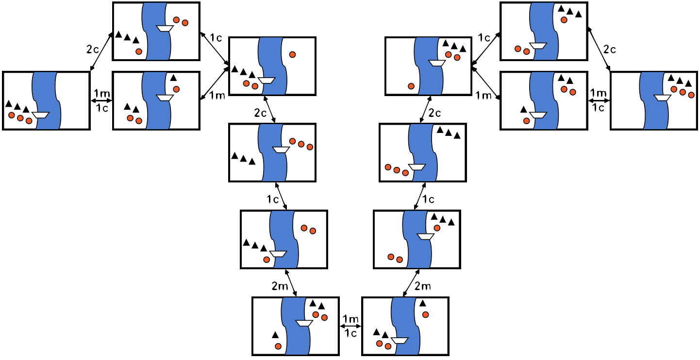

# River

The problem of the farmer that wants to cross a river with a wolf, a sheep and a cabbage is quite famous.
This same problem has been formulated in quite a few different ways and quite a few different historical times.
From the Arabian night's until the Simpsons or with a fox, a chicken and a grain.

Some of the formulations of the problem conceptually allow to extend it from it´s original 3 dimensional restriction set to an n-dimensional restriction set.
This is the case with the husbands or the cannibals formulations.

Even though it is a restriction problem it can be solved through planning technics.

## Solution to the problem with 3 cannibals and 3 missioners

## Extra information

This problem even though easy to solve by hand it is not as easy to solve by most planners.
The main difficulties to solve it are:

* Most planners cannot properly traverse a plan tree with natural numbers.
* Some planners can only have some logical operations expressed in certain ways.

Solving the problem with a planner not only means to know to sole the problem by hand.
In fact it does not only mean to be able to express the problem in the pddl languaje.
It also means to understand the pddl that the specific planner can understand in a good enough way to be able to make valid plans.
