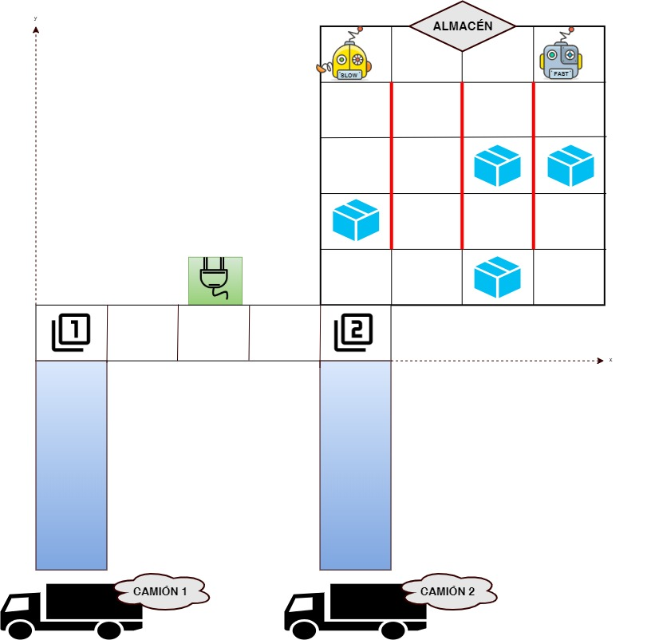

# Almacén de paquetes

Disponemos de varios robots dentro de un almacén de paquetes los cuales se encargarán de recogerlos y ponerlos en cintas transportadoras que los llevarán a varios camiones. El
objetivo es cargar los paquetes lo más rápido posible dentro de ellos y proceder a su envío.

El estado inicial del problema se puede observar en la siguiente ilustración.

## Modelización

El almacén, modelado mediante una cuadrícula con posiciones x e y, cuenta con paredes internas a través de las cuales no podrán pasar los robots, es decir, no habrá conexión entre las casillas contiguas a ellas.

En conexión con este almacén encontramos un pasillo desde el cual se puede acceder a las cintas transportadoras y/o a la estación de carga. Tanto las cintas como la estación se encontrarán en una cierta posición (x, y).

Respecto a los robots, disponen de dos modos de velocidad, lento y rápido, y ambos comienzan en una cierta posición del almacén. Dispondrán de un nivel de batería que se irá gastando tanto al moverse, coger, y dejar el paquete.

Un cierto paquete solo podrá ser depositado en una de las cintas transportadoras.

Se han realizado dos problemas diferentes:

* Problema 1: se dispone de 4 paquetes y 3 paredes.
* Problema 2: aumenta en uno tanto los paquetes como las paredes.

## Acciones

* charge: asigna al robot su capacidad máxima de batería.
* move: mueve un robot a una cierta posición.
* loadPackage: carga un paquete del almacén al robot.
* unloadPackage: descarga un paquete del robot a una cinta transportadora.
* movePackage: mueve el paquete sobre la cinta transportadora.
* sendTruck: indica que el camión ha sido enviado cuando esté lleno.

## Contributing

*Juan Casado Ballesteros*

*Juan José Córdoba Zamora*

*Gabriel López Cuenca*

*Miguel Ángle Losada Fernández*

*Sara Martínez Martínez*

*Sergio Sanz Sacristán*

*Álvaro Zamorano Ortega*