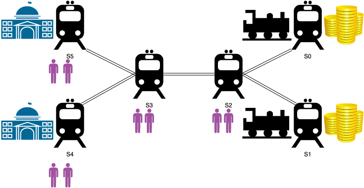

# The Solomon King's Mines

The Solomon King's Mines are overflowing gold but the transport system is not able to carry it to the strongholds where is stored.

The transport system consist of two trains that move the gold from the mines to the strongholds.
There are two train stations on the mines, one train station at each stronghold and two more along the way.

Only one train can stop on a train station at a time.
When a train is stopped on a train station workers can offload the gold.
Also they can get out the train and stay on the train station.

If a train is topped on one train station the other train can pass through the train station without stopping or stop next to the other train.
If two trains stay next to each other workers can get out but cannot offload gold.

When Solomon King opened its mines he hired the best workers in the hole realm.
They are that good than when cooperate are able to load and offload gold squared fast.
On the other hand at that time trains where so inchoate that where squared slow to the amount of weight they carried.
The good part about them is that they can move without a conductor.

```js
trainSpeed = baseTrainSpeed/(averageWorkerWeight*workers + goldWeight)^2
offloadTime = (averageWorkerWeight*workers)^2
```

The train Station are connected in this pattern:



The workers live on the stations S5 S4 S3 S2, two on each, they start there and also need to be carried there at the end of the day.
The mines are at stations S1 and S0.
The goal is to transport 100Kg of gold to stations S4 and S5 as fast as it is possible.

Solomon King is also wandering what would be better for it business, to hire an extra worker ot to buy an extra train.
If only he had a way to predict how this will affect the time needed to transport the gold.

*Problem solved by:*

*Juan Casado Ballesteros*

*Juan José Córdoba Zamora*

*Gabriel López Cuenca*

*Miguel Ángle Losada Fernández*

*Sara Martínez Martínez*

*Sergio Sanz Sacristán*

*Álvaro Zamorano Ortega*
